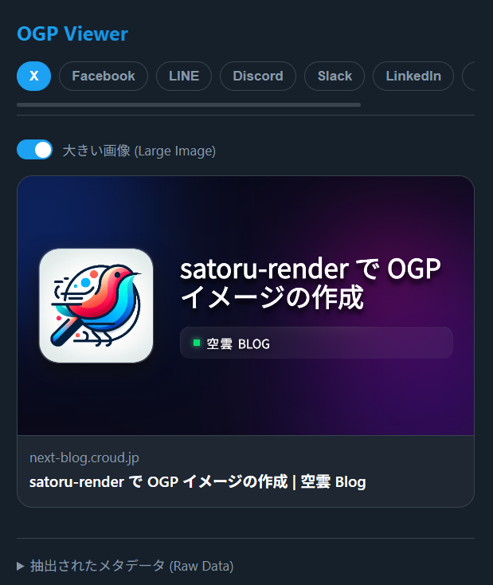

# OGP Viewer & Simulator

現在のWebページに設定されているOGP（Open Graph Protocol）タグや `twitter:card` 設定を自動的に抽出し、各主要なSNS・コミュニケーションツールでの表示（リンクプレビュー）をシミュレートするChrome拡張機能です。



## 主な機能

- **ワンクリック抽出**: 拡張機能のアイコンをクリックするだけで、表示中ページのメタデータ（タイトル、説明文、画像、ドメイン等）を即座に取得します。
- **8つのプラットフォームを網羅**: 取得したデータをもとに、以下のプラットフォーム上でのプレビューUIを忠実に再現します。
  1. X (Twitter) - 大・小画像の切り替えが可能
  2. Facebook
  3. LINE - トークルーム風のUI
  4. Discord - Embed（埋め込み）風UI
  5. Slack
  6. LinkedIn
  7. はてなブックマーク (Hatena)
  8. Apple Messages (iMessage)
- **スマートフェールバック**: OGPタグが存在しない場合でも、通常の `<title>` や `<meta name="description">` から情報を適切に補完します。
- **生データ確認**: 抽出したメタデータのJSONフォーマット（Raw Data）をそのまま確認できます。
- **多言語対応 (i18n)**: 日本語と英語に対応しており、OSやブラウザのロケール設定に応じて表示言語が自動で切り替わります。

## インストール方法（開発者モード）

このプロジェクトをローカルからChromeに読み込んで使用する手順は以下の通りです。

1. Chromeブラウザを開き、アドレスバーに `chrome://extensions/` と入力します。
2. 画面右上の **「デベロッパー モード」** のトグルをオンにします。
3. **「パッケージ化されていない拡張機能を読み込む」** をクリックし、当プロジェクトのフォルダ（`manifest.json` が含まれているディレクトリ）を選択します。
4. 拡張機能一覧に「OGP Viewer & Simulator」が追加されます。アドレスバー横のパズルアイコンからピン留めしておくと便利です。

## 使用方法

任意のWebページを開いた状態で拡張機能のアイコンをクリックしてください。
ポップアップが展開し、各タブを切り替えるることでプレビューをリアルタイムで確認できます。タブ部分は横スクロールが可能です。

> **注意:** Google検索トップなどのシステムページ (`chrome://` など) ではセキュリティ制約のため実行できません。

## ディレクトリ構成

```text
├── _locales/
│   ├── en/messages.json    # 英語の翻訳辞書
│   └── ja/messages.json    # 日本語の翻訳辞書
├── manifest.json           # 拡張機能の設定ファイル (Manifest V3)
├── popup.html              # UIの構造 (HTML)
├── popup.css               # UIのスタイル・各SNS風CSS
└── popup.js                # メタデータの抽出処理とUI制御ロジック
```

## ライセンス

MIT License
